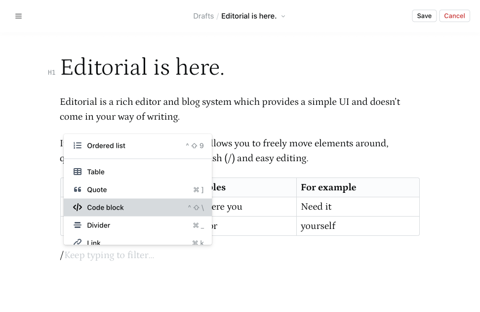

Editorial is a blog and editor interface for my personal website. It's powered
by Next.js, Recoil, rich-markdown-editor and more.

It is still under development and lacks a few features.



---

## Features

- **Persistence** — Persists all changes locally and syncs with backend service
  to save changes remotely frequently.
- **Block-based Markdown Editor** — The editor is powered by
  [outline/rich-markdown-editor](https://github.com/outline/rich-markdown-editor)
  and provides a fast way to write posts, using markdown under the hood.

More features will be added in the future.

## Development

Editorial uses [Next.js][nextjs-github] with [Prisma][prisma-github] and
[Nexus][nexus-github] for the GraphQL service.

```
git clone https://github.com/fnky/editorial.git
cd editorial
yarn
yarn setup
```

### Setup Postgres database

For development, you can use Docker to create a development database.

Run the following command in the project directory to create and run new
Postgres container in detached mode:

```
docker-compose up -d
```

You can stop and remove the container with the `down` command.

By default the PostgreSQL is setup with the following credentials:

```
Username: meerkat
Password: wonderland
Database: editorial
```

This is set in `.env`, however you can override it by creating a `.env.local`
file with a custom `DATABASE_URL` environment variable.

All data is saved to a `pgdata` folder, which allows you to restore the data
across containers at any time.

### Migrations

When changing the `prisma/schema.prisma` file you can push the state of the
schema to the database during prototyping:

```sh
yarn prisma db push --preview-feature
```

To create a [migration][prisma-migrate], run the following commands:

```sh
# Generate type definitions and run migrations
yarn generate
yarn db:migrate
```

To reset the database and apply migrations, run:

```sh
yarn db:reset
```

You can run `yarn db:seed` to seed the database with some fake data at any time,
during development.

> **Note:** Using Prisma CLI currently doesn't work with project's
> `tsconfig.json` for seeding, use the npm scripts instead. See
> [prisma/#5718](https://github.com/prisma/prisma/pull/5718)

## Resources

- [Upgrading Nexus Prisma to Nexus][upgrade-nexus-prisma] - Still a bit
  outdated, but useful for the most part.
- [Nexus Plugin Prisma example project][upgrade-nexus-prisma] - Useful for some
  setup and troubleshooting.

[nexus-github]: https://github.com/graphql-nexus/nexus "graphql-nexus/nexus"
[prisma-github]: https://github.com/prisma/prisma "prisma/prisma"
[nextjs-github]: https://github.com/vercel/next.js "vercel/next.js"
[prisma-migrate]: https://www.prisma.io/docs/concepts/components/prisma-migrate "Prisma Migrate"
[upgrade-nexus-prisma]: https://www.prisma.io/docs/guides/upgrade-guides/upgrade-from-prisma-1/upgrading-nexus-prisma-to-nexus "Upgrading Nexus Prisma to Nexus"
[nexus-plugin-prisma-example]: https://github.com/graphql-nexus/nexus-plugin-prisma/tree/main/examples/blog "nexus-plugin-prisma Example"
